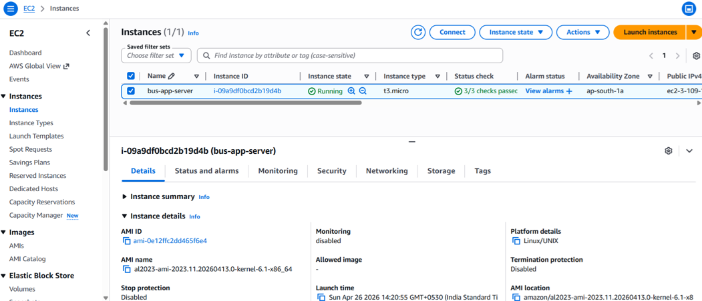
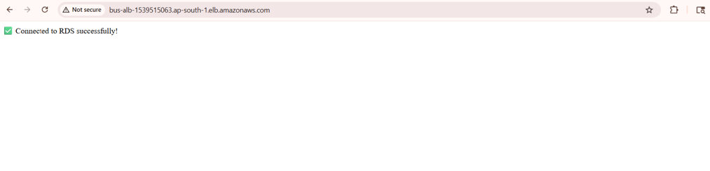
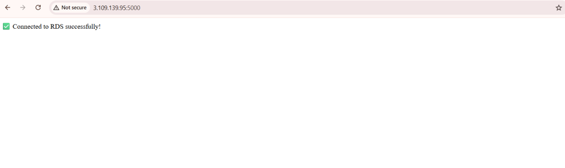

# Deploy-Bus-Booking-Application
Deployed a Bus Booking Application on AWS using EC2, RDS, and Load Balancer for scalable and reliable real-world application hosting.

# Deploy Bus Booking Application

## 🎯 Purpose

The purpose of this project is to deploy a real-world Bus Booking Application on AWS using scalable and reliable cloud infrastructure.

This project demonstrates:

* Deployment of a full-stack web application
* Hosting application servers on AWS
* Database integration and management
* Load balancing for high availability
* Scalable and secure cloud architecture

The application allows users to search, book, and manage bus tickets through a web-based interface.

## 🧰 AWS Services Used

* **Amazon EC2** – Used for hosting the Bus Booking Application servers.
* **Amazon RDS** – Used for managing the relational database securely.
* **Elastic Load Balancer (ELB)** – Used for distributing incoming traffic across multiple application servers.

## 📸 Project Screenshots

### 1. EC2 Instances
This shows the running EC2 instances for the Bus Booking Application.

### 2. Load Balancer
This shows traffic distribution using the Load Balancer.

### 3. Security Groups
This shows the security group configuration.

### 4. Target Groups
This shows registered targets and their health status.

### 5. Application Output - DNS
This shows application access using the Load Balancer DNS.

### 6. Application Output - IP
This shows application access using the Public IP address.

